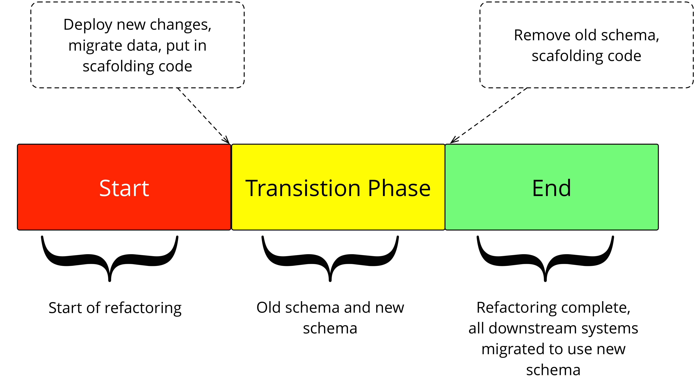
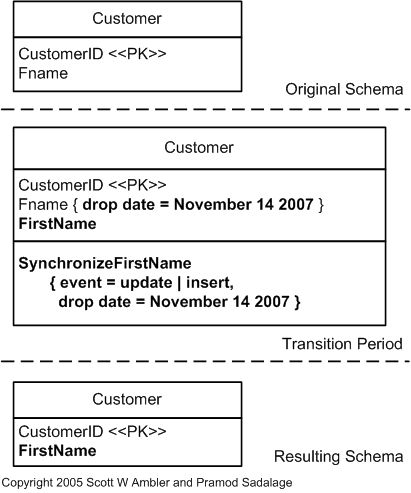

# Evolutionary Database Design

At Bitwarden we follow [Evolutionary Database Design (EDD)](https://en.wikipedia.org/wiki/Evolutionary_database_design). EDD describes a process where the database schema is continuously updated while still ensuring compatibility with older releases by using database transition phases.

In short the Database Schema for the Bitwarden Server **must** support the previous release of the server. The database migrations will be performed before the code deployment, and in the event of a release rollback the database schema will **not** be updated.

## Design

### Nullable

Database tables, views and stored procedures should almost always use either nullable fields or have a default value. Since this will allow stored procedures to omit columns, which is a requirement when running both old and new code.

### EDD Process

The EDD breaks up each database migration into three phases. _Start_, _Transition_ and _End_.

<figure markdown>
  
  <figcaption markdown>[https://www.martinfowler.com/articles/evodb.html#TransitionPhase](https://www.martinfowler.com/articles/evodb.html#TransitionPhase)</figcaption>
</figure>

This necessitates two different database migrations. The first migration adds new content and is backwards compatible with the existing code. The second migration removes content and is not backwards compatible with that same code prior to the first migration.

### Example

Let’s look at an example, the rename column refactor is shown in the image below.

<figure markdown>
  
</figure>

In this refactor we rename the column `Fname` in the `Customer` table to `FirstName`. This could easily be achieved using a regular `Alter Table` statement but that would break compatibility with existing running code. Instead let's look at how we can incrementally refactor this table.

We will begin by creating a migration which adds the column `FirstName` to the `Customer` Table. At the same time we will also update the Stored Procedures to sync the content between `FName` and `FirstName` which ensures both the old and new server releases can run at the same time. The sync code is highlighted in the code snippet below.

Afterwards the new server version will be deployed, once everything checks out the existing data will be migrated using a _Data Migration_ script. Which essentially copies the `FName` to `FirstName` columns.

Lastly the _Second Migration_ will be run which removes the old column and updates the Stored Procedure to remove the synchronization logic.

#### Migrations

!!! note
    All database migrations should support being run multiple times; even if subsequent runs perform no actions.

=== "First Migration"

    ```tsql hl_lines="27"
    -- Add Column
    IF COL_LENGTH('[dbo].[Customer]', 'FirstName') IS NULL
    BEGIN
        ALTER TABLE
            [dbo].[Customer]
        ADD
            [FirstName] NVARCHAR(MAX) NULL
    END
    GO

    -- Drop existing SPROC
    IF OBJECT_ID('[dbo].[Customer_Create]') IS NOT NULL
    BEGIN
        DROP PROCEDURE [dbo].[Customer_Create]
    END
    GO

    -- Create the new SPROC
    CREATE PROCEDURE [dbo].[Customer_Create]
        @CustomerId UNIQUEIDENTIFIER OUTPUT,
        @FName NVARCHAR(MAX) = NULL, -- Deprecated as of YYYY-MM-DD
        @FirstName NVARCHAR(MAX) = NULL
    AS
    BEGIN
        SET NOCOUNT ON

        SET @FirstName = COALESCE(@FirstName, @FName);

        INSERT INTO [dbo].[Customer]
        (
            [CustomerId],
            [FName],
            [FirstName]
        )
        VALUES
        (
            @CustomerId,
            @FirstName,
            @FirstName
        )
    END
    ```

=== "Data Migration"
    ```tsql
    UPDATE [dbo].Customer SET
        FirstName=FName
    WHERE FirstName IS NULL
    ```

=== "Second Migration"

    ```tsql
    -- Remove Column
    IF COL_LENGTH('[dbo].[Customer]', 'FName') IS NOT NULL
    BEGIN
        ALTER TABLE
            [dbo].[Customer]
        DROP COLUMN
            [FName]
    END
    GO

    -- Drop existing SPROC
    IF OBJECT_ID('[dbo].[Customer_Create]') IS NOT NULL
    BEGIN
        DROP PROCEDURE [dbo].[Customer_Create]
    END
    GO

    -- Create the new SPROC
    CREATE PROCEDURE [dbo].[Customer_Create]
        @CustomerId UNIQUEIDENTIFIER OUTPUT,
        @FirstName NVARCHAR(MAX) = NULL
    AS
    BEGIN
        SET NOCOUNT ON

        INSERT INTO [dbo].[Customer]
        (
            [CustomerId],
            [FirstName]
        )
        VALUES
        (
            @CustomerId,
            @FirstName
        )
    END
    ```

## Workflow

The Bitwarden specific workflow for writing migrations are described below.

### Developer

The development flow is described in [Migrations](./migrations.md).

### Devops

#### On `rc` cut

Create a PR moving the future scripts.

* `DbScripts_future` to `DbScripts`, prefix the script with the current date, but retain the existing date.
* `dbo_future` to `dbo`.

#### After server release

1. Run whatever data migration scripts might be needed. (This might need to be batched and executed until all the data has been migrated)
2. After having the server run for a while execute the future migration script to clean up the database.

## Rollbacks

In the event the server release failed and needs to be rolled back, it should be as simple as just re-deploying the previous version again. The database will **stay** in the transition phase untill a hotfix can be released, and the server can be updated.

The goal is to resolve the issue quickly and re-deploy the fixed code to minimize the time the database stays in the transition phase. Should a feature need to be completely pulled, a new migration needs to be written to undo the database changes and the future migration will also need to be updated to work with the database changes. This is generally not recommended since pending migrations (for other releases) will need to be revisited.

## Testing

Prior to merging a PR please ensure that the database changes run well on the currently released version. We currently do not have an automated test suite for this and it’s up to the developers to ensure their database changes run correctly against the currently released version.

## Further Reading

- [Evolutionary Database Design](https://martinfowler.com/articles/evodb.html)
  (Particularly [All database changes are database refactorings](https://martinfowler.com/articles/evodb.html#AllDatabaseChangesAreMigrations))
- [The Agile Data (AD) Method](http://agiledata.org/)
  (Particularly [Catalog of Database Refactorings](http://agiledata.org/essays/databaseRefactoringCatalog.html))
- [Refactoring Databases: Evolutionary Database](https://databaserefactoring.com/)
- Refactoring Databases: Evolutionary Database Design (Addison-Wesley Signature Series (Fowler)) ISBN-10: 0321774515
